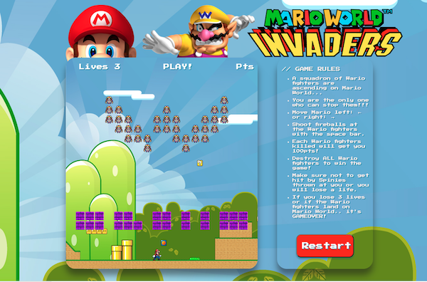
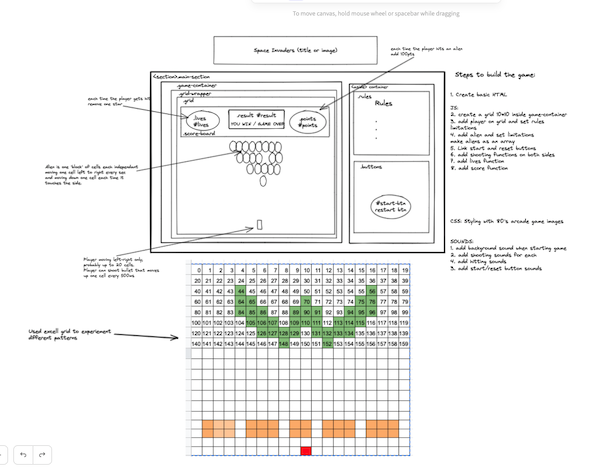
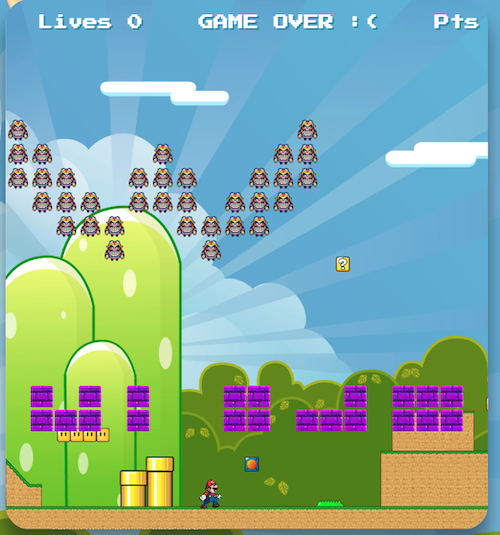

# MARIO WORLD SPACE INVADERS


## Project Description
Mario World Space Invaders is a JavaScript powered game inspired by the original Space Invaders, a shoot 'em up arcade game 
developed by Tomohiro Nishikado and released back in 1978. The player aims to shoot an invading alien armada, before it reaches the planet's surface using a mounted gun turret. The game's concept is based on Space Invaders whilst the designs and characters are from the famous Mario World.

## Deployment Link
 [https://thomalex001.github.io/ga-project-1/](https://thomalex001.github.io/ga-project-1/ "Mario World Space Invaders")

## Getting Started/Code Installation
Once the project is cloned onto your machine, right click on the **index.html** file in the source folder and choose **"Open with live 
server"**. The game is ready to be played, I would recommend Chrome as a browser.

## Timeframe 
This was a solo project to be completed within in one week.

## Technologies Used
* Excalidraw (wireframe)
* HTML
* CSS
* Javascript
* Excell
* Visual Studio Code
* Google Fonts

## Brief
### Gameplay
* The player can only move left or right. 
* The aliens also move from left to right, and also down each time the reach the side of the screen. 
* The aliens also periodically drop bombs towards the player.
* Once the player has destroyed a wave of aliens, the game starts again. 
* The aim is to achieve the highest score possible before either being destroyed by the aliens, or allowing them to reach the 
planet's surface.

### Requirements
* The player should be able to clear at least one wave of aliens.
* The player's score should be displayed at the end of the game.

### Suggested enhancements
* Responsive design.
* Each wave gets more difficult.
* Persistent leaderboard using localStorage.

### Challenges you will face
The main challenge here is the movement of large groups of aliens in formation, and the animation of the bombs and player's shots. 
There are several approaches here, with collision detection being the more challenging.


## Planning


* Used Excalidraw to build a wireframe and design the basic layout of the game.
* Wrote down the overall approach in a step-by-step guide which can be seen on the right hand side.
* Included the player and ennemy position and their restricted movements. 
* Drew a sketch of the features shown when playing the game such as: Lives left, Total points, Winner.
* Added button and it's purpose, as well as it's class earlier on.
* Pre-named each `<div>` components classes in order to have a reference point in later stages.
* Used an spreadexcell sheet to experiment with different ennemy design patterns which I found very useful. 
I chose a **"W"** shape to recall the ennemy's name : **Wario!**
* Also added the position of the **shields** that protect the player.

## Build/Code Process

### Day One

* HTML
  * Created the bast of the HTML structure.

* CSS
  * Styled the grid and used flexbox to move `<aside>` section containing **Rules** and **Button** to the right.
  * Created a **"Play/Restart"** button. 
  * Linked the **"Play/Restart"** button to JavaScript using the `document.querySelector('#start-btn')` method. 
  * Tested the **"Play/Restart"** and all working OK.

* JavaScript
  * Created a grid 10x10 using a for loop:
  ```javascript
   const grid = document.querySelector('.grid');

  function createGrid() {
    for (let i = 0; i < cellCount; i++) {
      const cell = document.createElement('div');
      grid.appendChild(cell);
     cells.push(cell);
    }`
  `}
  ```
  * Added the player and the invaders on the grid.
  * Had real difficulty with the invaders moving pattern.
  * Used `"!goingRight"` (app.js - line 100) with a bang operator instead of`"goingLeft"` which fixed the issue with invdaders moving pattern.
  * Increased the grid to **20x20** as it did not allow enough movement for the player and ennemy.

### Day Two

* HTML
 * Made some tweaks to the structure to adapt the added CSS. 
 * Added `<span>` elements for **Lives**, **Results** and **Points**, added second container for the score-board.
 * Typed up all content such as GAME RULES, SCORE and LIVES.
 * Found and added a retro game font for the whole page.

* JavaScript
  * Created `playerShooting()` function for the Player (when pressing down space bar key).
  * Created `invadersShooting()` function for the Invaders (randomly shooting in intervals) using `math.random()`.
 

* CSS
 * Styled the page with a background Mario World gameplay image.
 * Added Mario's fireballs when shooting.
 * Added invaders "spinies" or ("turtles" 🐢) as bullets.
 * Added a brick wall as Mario's shield.
 * Added box-shadow on both game-container and `<aside>` container to add some depth to the game


### Day Three

* HTML
  * Added `<audio>` tags and tested the background sound when the **Play button** is clicked.

* JavaScript
  * Added a display of **"lives left"** with changes made in the DOM when the player is hit by an invader's bullet.
  * Added **"Game Over"**  and **"You Win!"** to the DOM.



  * Had a bug when added invaders as a **"W"** shape as they were coming off the screen. 
    * Fixed the bug  with `"e % width === 0)"` code (app.js line 97)
  * When creating the **Play/Restart** button I got lots of bugs in the game such as: 
    * Bullets getting stuck in the grid
    * Bullets or bricks collision not happening.
  * In order to fix these issues, I included most functions for the game in the "Play" function to resolve this, however still had some issues with it.

* CSS
  * Created Play/Restart button and styled to ressemble an 80's arcade games.
  * Added various styling and colors to the game.


### Day Four

* HTML
  * Added a two more `<audio>` tags so that each sounds can be played simultaneously, for example: the background music can play continuously whilst the bullets can be be heard when fired.
  * Added an icon to the browser tab.

* JavaScript
  * Debuged balls going off grid.
  * Debuged balls killing all invaders in their path (a ball should kill an invader when
  hitting it and then disappear).
  * Debugged turtles getting stuck on the grid randomly, by increasing their speed.

* CSS
  * Created responsive design for screens under 1130px.

### Day Five

* HTML
  * None required.

* JavaScript
  * Added sounds for:
    * Start button
    * Background music
    * Balls/bullet being thrown
    * Invaders/Player getting hit
    * Winning music
    * Game Over music
  * Refactored and added comments to section my code.

* CSS
  * Added background images
  * Created personalised logo 
  * Modified colors of button to match logo colors


## Challenges
I came accross many challenges whilst building this game, some took a lot of time to fix, others were a great learning curve and I wish to share these too:

The hardest things to debug were `PlayerShooting()` and `InvadersShooting()` functions.
What I found difficult was getting my head around the consecutive `if()` statements and the layered complexity they created. This function is longest I had written up to that point (around 30 lines).

``` javascript
function playerShooting(event) {
    let currentBallPosition = playerPosition;
    function shootBall() {
      const y = Math.floor(currentBallPosition / width);
      if (y === 0) {
        cells[currentBallPosition].classList.remove('ball');
        clearInterval(ball);
      } else if (cells[currentBallPosition].classList.contains('invaders')) {
        playMoreSounds.src = './sounds/mario-yahoo.mp3';
        playMoreSounds.play();
        clearInterval(ball);
        cells[currentBallPosition].classList.remove('ball');
        cells[currentBallPosition].classList.remove('invaders');
        const invaderShot = invaders.indexOf(currentBallPosition);
        invaders.splice(invaderShot, 1);
        points += 100;
        displayPoints.innerHTML = points;
        if (invaders.length === 0) {
          playerWins();
        }
      } else if (cells[currentBallPosition].classList.contains('shield')) {
        clearInterval(ball);
        cells[currentBallPosition].classList.remove('ball');
      } else {
        cells[currentBallPosition].classList.remove('ball');
        currentBallPosition -= width;
        cells[currentBallPosition].classList.add('ball');
      }
    } if (event.keyCode === 32) {
      ball = setInterval(shootBall, 100);
      playSounds.src = './sounds/ball.mp3';
      playSounds.play();;
    }
  }
```

## Wins
* Working with the DOM became second nature after a couple of days of developing this app which I was pleased about
* I now have a much better understanding in JavaScript functions, `for()` loops, `if()` statements etc.. 
* Looking at the finished game, I am very pleased with the design and main functionalities even if some bugs can still be found when playing it.


## Key Learning/Takeways
* I learned a lot about the logic behind each JavaScript functions used in this game and how they are all connected. 
* I got to practice vanilla JavaScript in the DOM which were obscure concepts to me only a few days prior.
* Building this game also really taught me how important the first stages of developing an app, such as
creating a wireframe to refer to and planning the week ahead.
* I have to say that I learned the most when debuging and when asking for help to my teachers and classmates.

## Bugs
* Firing balls gets disabled if the player is shooting the shield too many times.
* In the eventuality that the ennemies touch the ground before touching the Player, the game does not end.

## Future Improvements
* Reduce the number of bullets that can be thrown per seconds. Possibly use an interval.
* Add collision styling when bullets/balls hit a target.
* Flip axis of Player's image left to right when keys are being pressed to simulate movement.


## THANKS FOR READING!

⠀⠀⠀⠀⠀⠀⠀⠀⠀⠀⠀⠀⠀⠀⠀⠀⠀⢀⣠⣤⣶⡾⠿⠿⠿⢿⣶⣤⡀⠀⠀⠀⠀⠀⠀⠀⠀⠀⠀⠀⠀⠀⠀⠀⠀⠀
⠀⠀⠀⠀⠀⠀⠀⠀⠀⠀⠀⠀⠀⠀⠀⣠⣶⡿⠛⠉⠀⠀⠀⡀⠀⠀⡈⠙⢿⣆⠀⠀⠀⠀⣠⣤⣤⣄⠀⠀⠀⠀⠀⠀⠀⠀
⠀⠀⠀⠀⠀⠀⠀⠀⠀⠀⠀⠀⠀⣠⣾⠟⠁⠀⠀⠀⠀⡐⠁⡀⠀⣤⠀⠑⡌⣿⡆⢀⣤⣾⣿⣋⠙⠻⣿⣶⣦⣤⡀⠀⠀⠀
⠀⠀⠀⠀⠀⠀⠀⠀⠀⠀⠀⢀⣴⡿⠋⠀⠀⠀⠀⠀⠀⠁⠀⣿⢾⠟⣷⠀⢸⣸⣿⣿⣯⣥⣀⣉⡙⣦⠀⠀⠈⠛⣿⣆⠀⠀
⠀⠀⠀⠀⠀⠀⠀⠀⠀⠀⢀⣾⡟⠁⠀⠀⠀⠀⠀⠀⠀⢆⠀⢛⡠⠤⠚⠚⠉⠉⠉⠁⠀⠉⣉⣉⣛⣿⡄⠀⠀⠀⠘⣿⡄⠀
⠀⠀⠀⠀⠀⠀⠀⠀⠀⢀⣿⡟⠀⠀⠀⠀⠀⠀⠀⢀⣤⠞⠋⠁⠀⠀⠀⠀⢀⣠⣴⣶⣿⣿⣿⣿⣿⠿⠷⠤⠤⠀⢠⣿⠃⠀
⠀⠀⠀⠀⠀⠀⠀⠀⠀⣼⡿⠀⠀⠀⠀⠀⠀⣠⠞⠉⠀⠀⠀⠀⠀⣠⠴⠚⠉⢉⠹⣿⡿⠿⠛⠉⠀⠀⠀⠀⠀⢀⣾⡟⠀⠀
⠀⠀⠀⠀⠀⠀⠀⣠⣤⣿⠁⠀⠀⠀⠀⣠⠞⠁⠀⠀⢀⣠⠤⢒⠉⠀⠀⠀⠀⣿⣧⣸⣇⣀⣀⡀⠀⠀⠤⠤⣴⣿⠟⠁⠀⠀
⠀⠀⠀⠀⠀⢠⣾⠟⠉⡝⠀⠀⠀⢀⣼⣷⠖⠒⠒⠋⠉⠀⠀⣿⣷⠀⠀⠀⠀⡹⠛⠉⠉⠉⠙⠻⢷⣄⣀⣠⣿⡇⠀⠀⠀⠀
⠀⠀⠀⠀⢠⣿⠃⠀⠀⠀⠀⠀⢀⣾⣿⣿⣆⠀⠀⠀⠀⠀⠀⠹⣿⠀⠀⠀⠀⠀⠀⠀⠀⠀⠀⠀⠀⢻⣿⠟⠋⠀⠀⠀⠀⠀
⠀⠀⠀⠀⠸⣿⠀⢀⣤⠖⠒⠒⠚⢿⣿⣿⣿⣶⣤⠀⠀⢀⡀⠀⠈⠀⠀⠀⠀⠀⠀⠀⠀⠀⠀⠀⠀⢸⣿⠀⠀⠀⠀⠀⠀⠀
⠀⠀⠀⠀⠀⠻⣷⡟⠁⠀⠠⢄⡀⠈⠻⣿⣿⣿⠟⠀⠀⣾⣿⣷⣦⣄⣀⣀⡀⠀⠀⠀⠀⠀⠀⠀⣠⣿⠏⠀⠀⠀⠀⠀⠀⠀
⠀⠀⠀⠀⠀⠀⣿⡀⠀⠀⠀⠀⠻⡄⠀⠈⠙⠋⠀⠀⠀⠹⣿⣿⣿⣿⣿⣿⣿⣷⣦⣤⣤⣤⣶⣾⡿⠋⠀⠀⠀⠀⠀⠀⠀⠀
⠀⠀⠀⠀⠀⠀⢹⣧⡀⠀⠀⠀⠐⠁⠀⠀⠀⠀⠀⠀⠀⠀⠈⢹⣿⣿⣿⣿⣿⣿⣿⣿⣿⣿⣿⡟⠀⠀⠀⠀⠀⠀⠀⠀⠀⠀
⠀⠀⠀⠀⠀⠀⠀⠙⢿⣦⣤⣄⣀⣤⣤⣤⡀⠀⠀⠀⠀⠀⠀⠀⡟⠻⠟⠛⢿⡿⣿⠟⢩⣿⠟⠀⠀⠀⠀⠀⠀⠀⠀⠀⠀⠀
⠀⠀⠀⠀⠀⠀⠀⠀⠀⠈⣙⣿⣿⣿⣿⣿⣿⣦⣄⡀⠀⠀⠀⠀⣇⠀⣀⡴⢋⡴⢋⣴⡿⠋⠀⠀⠀⠀⠀⠀⠀⠀⠀⠀⠀⠀
⠀⠀⠀⠀⠀⠀⠀⣠⣶⡿⠛⠉⠁⠀⠀⠀⠀⢈⣿⠻⣶⢦⣤⣤⣨⣭⡥⢶⡻⣷⣿⠏⠀⠀⠀⢀⣀⣤⣤⣤⣤⣀⠀⠀⠀⠀
⠀⠀⠀⢠⣶⡿⠿⠿⠷⢤⣀⠀⠀⠀⣀⣤⠖⠋⠁⠀⢹⠀⠀⠀⠳⡄⢀⣀⣱⡌⠻⣿⣶⣤⣴⣿⠟⠋⠉⠙⠛⢿⣷⣄⠀⠀
⠀⢀⣤⣿⠟⠀⠀⠀⠀⠀⠈⠑⢦⣾⠟⠁⠀⠀⠀⠀⢸⠀⠀⣠⠤⠬⢍⡁⠀⠀⠀⣟⠙⢿⣿⠃⠀⠀⠀⠀⠀⠀⢻⢿⣿⡄
⢀⣾⠏⠀⢀⠀⠀⠀⠀⠀⠀⠀⣸⡏⠀⠀⠀⠀⠀⣠⠏⠀⣸⠃⠀⠀⠀⢱⠀⠀⠀⢻⡀⢸⣿⠀⠀⠀⠀⠀⠀⠀⡞⢀⣿⡿
⣼⡏⠀⢰⡏⠀⣠⡆⠀⠀⠀⠀⠘⡏⠲⠦⠤⠴⠚⠁⠀⠀⠸⡄⠀⠀⠀⡸⠀⠀⠀⠀⠱⣾⡿⠀⠀⠀⠀⠀⠀⡸⠁⣼⣿⠃
⢿⡇⠀⠈⠀⠀⠟⠀⠀⠀⡀⠀⠀⣿⣄⣀⠀⠀⠀⠀⠀⠀⠀⠉⠓⠒⠋⠀⠀⠀⠀⠀⢰⣿⠃⠀⠀⠀⠀⠀⢰⢁⣾⡿⠃⠀
⠘⣿⣄⠀⠀⠀⠀⠀⠀⣰⣥⣤⡾⠟⠛⠻⣷⣤⣀⠀⠀⠀⠀⠀⠀⠀⠀⠀⠀⠀⠀⢠⣾⡟⠀⠀⠀⠀⠀⠠⢃⣿⡿⠃⠀⠀
⠀⠈⠻⢿⣦⣄⣀⣀⣀⣠⡾⠋⠀⠀⠀⢰⠏⠙⣿⡇⠀⠀⠀⠀⠀⠀⠀⠀⠀⢀⣴⣿⢿⣿⣦⣀⣀⣀⣴⢁⣼⣿⠃⠀⠀⠀
⠀⠀⠀⠀⠈⠉⢻⣿⠏⡟⠀⠀⠀⠀⠀⡜⠀⠀⣿⣇⣀⠀⠀⢀⣀⣀⣤⣴⣾⡿⠋⠁⠀⠈⠛⠛⠛⠻⠿⣿⡿⠃⠀⠀⠀⠀
⠀⠀⠀⠀⠀⠀⣾⡏⢀⠇⠀⠀⠀⠀⠀⠃⠀⢸⣿⡟⠛⠿⠿⠟⠛⠛⠛⠉⠀⠀⠀⠀⠀⠀⠀⠀⠀⠀⠀⠀⠀⠀⠀⠀⠀⠀
⠀⠀⠀⠀⠀⢰⣿⠀⢸⠀⠀⠀⠀⠀⠀⠀⣠⣾⡿⠀⠀⠀⠀⠀⠀⠀⠀⠀⠀⠀⠀⠀⠀⠀⠀⠀⠀⠀⠀⠀⠀⠀⠀⠀⠀⠀
⠀⠀⠀⠀⠀⢸⣿⡀⣾⠀⠀⠀⠀⠀⠀⠀⣿⡟⠁⠀⠀⠀⠀⠀⠀⠀⠀⠀⠀⠀⠀⠀⠀⠀⠀⠀⠀⠀⠀⠀⠀⠀⠀⠀⠀⠀
⠀⠀⠀⠀⠀⠈⠻⣷⣿⣦⠀⠀⠀⠀⢀⣴⣿⠃⠀⠀⠀⠀⠀⠀⠀⠀⠀⠀⠀⠀⠀⠀⠀⠀⠀⠀⠀⠀⠀⠀⠀⠀⠀⠀⠀⠀
⠀⠀⠀⠀⠀⠀⠀⠀⠉⠛⠿⢷⣶⡾⠿⠛⠁⠀⠀⠀⠀⠀⠀⠀⠀⠀⠀⠀⠀⠀⠀⠀⠀⠀⠀⠀⠀⠀⠀⠀⠀⠀⠀⠀⠀⠀

